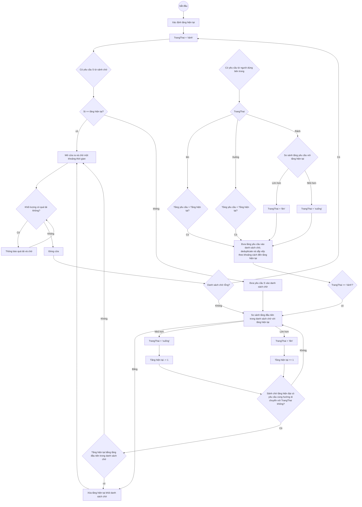
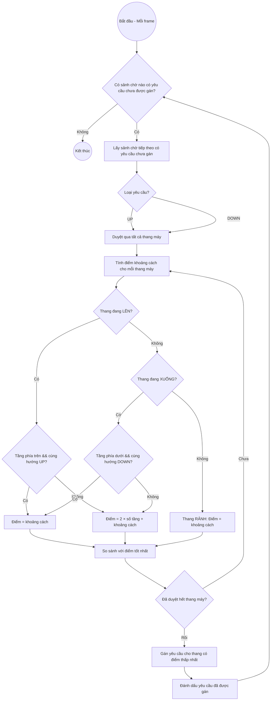
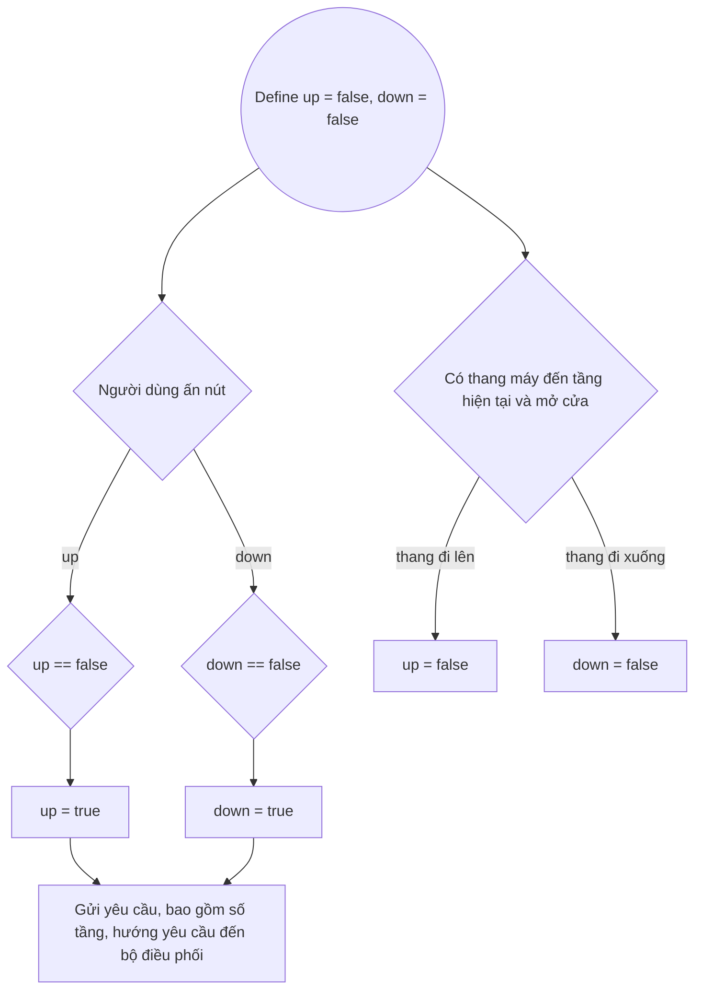
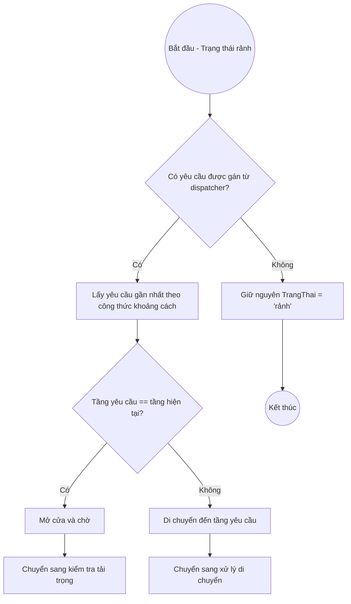
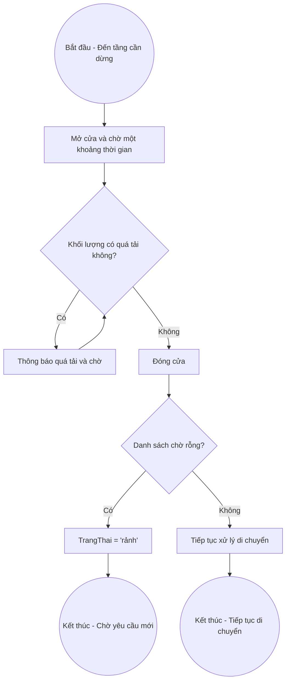
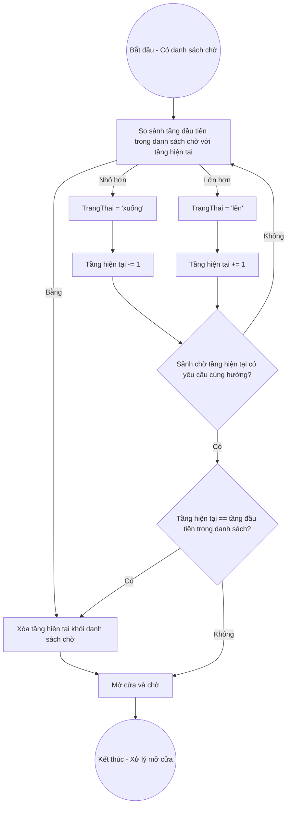
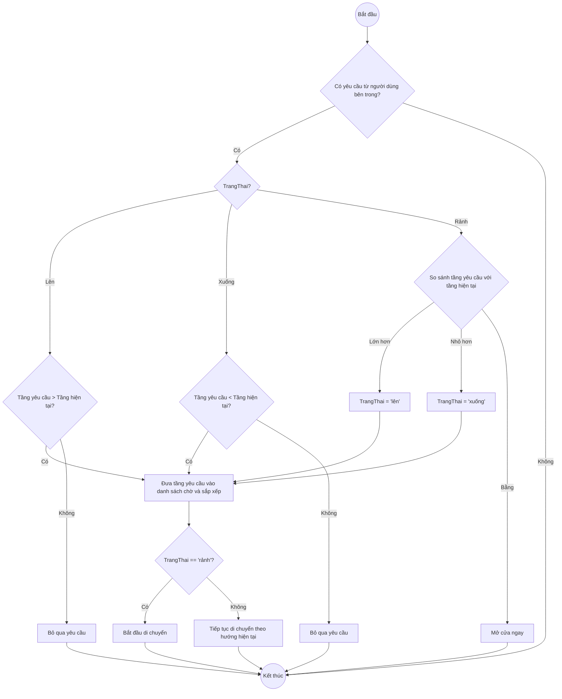

# Mô phỏng hệ thống thang máy trong tòa nhà cao tầng

## 1. Vấn đề
Khi xây dựng các tòa nhà cao tầng, việc có số lượng thang máy vừa đủ là rất quan trọng vì:
* Nếu số thang máy quá nhỏ thì sẽ dễ dẫn đến ùn tắc, chờ đợi lâu
* Nếu số lượng thang máy quá lớn thì chi phí đầu tư xây dựng và bảo trì sẽ tăng lên

## 2. Các thành phần trong hệ thống và chức năng của chúng
### Những người dùng thang máy
Đưa ra yêu cầu cho sảnh chờ, rồi khi vào thang máy thì đưa ra yêu cầu cho thang máy

### Bộ điều phối (Dispatcher):
* Nhận yêu cầu từ các sảnh chờ
* Tính toán thang máy có "khoảng cách" gần nhất cho mỗi yêu cầu (sử dụng công thức khoảng cách đặc biệt)
* Gán yêu cầu cho thang máy phù hợp nhất

**Công thức khoảng cách:**
- Nếu thang đang đi **LÊN**: 
  - Tầng phía trên có người muốn lên (cùng hướng) → điểm = khoảng cách
  - Các trường hợp khác → điểm = 2 × số tầng + khoảng cách
- Nếu thang đang đi **XUỐNG**: 
  - Tầng phía dưới có người muốn xuống (cùng hướng) → điểm = khoảng cách
  - Các trường hợp khác → điểm = 2 × số tầng + khoảng cách
- Nếu thang **RẢNH**: điểm = khoảng cách

Thang máy có điểm số thấp nhất sẽ được chọn để phục vụ yêu cầu đó.

### (Các) thang máy:
* Tiếp nhận yêu cầu nội bộ: Nhận yêu cầu "chọn tầng" từ người bên trong (lưu vào danh sách các yêu cầu bên trong).
* Tiếp nhận yêu cầu ngoại bộ: Nhận yêu cầu được gán từ Bộ điều phối.
* Kiểm tra tải trọng
* Di chuyển theo yêu cầu của hệ thống và người dùng

###	Sảnh chờ :
Tiếp nhận yêu cầu của người dùng (lên, xuống hay cả 2)

## 3. Input và output
### Các biến input:
* Trung bình số người đến tại mỗi tầng trong một đơn vị thời gian
* Số người chứa được trong mỗi thang máy
* Số thang máy
* Số tầng
### Các giá trị output:
* Số người chờ tại mỗi tầng
* Thời gian chờ trung bình
* Hiệu suất

## 4. Sơ đồ luồng hệ thống

### **Thang máy (Elevator)**

Thang máy xử lý di chuyển theo yêu cầu của người dùng và các yêu cầu được gán từ Bộ điều phối. 
Khi ở trạng thái 'rảnh', thang máy sẽ chờ yêu cầu được gán từ Bộ điều phối hoặc yêu cầu từ người trong thang. 
Khi không "rảnh", thang máy ưu tiên xử lý các yêu cầu từ bên trong thang máy trước, 
nhưng vẫn dừng lại ở các tầng có yêu cầu được gán nếu đi qua và có thể đón thêm người.

(Vui lòng xem sơ đồ ở trang sau)



### **Bộ điều phối (Dispatcher)**

Bộ điều phối chịu trách nhiệm phân bổ yêu cầu từ sảnh chờ cho thang máy phù hợp nhất dựa trên công thức khoảng cách đặc biệt.



### **Sảnh chờ / Tầng (Floor)**

Sảnh chờ hoạt động khá đơn giản, khi người dùng nhấn nút Up hoặc Down thì trạng
thái của nút đó sẽ thành True (hoặc giữ nguyên là True). Khi thang máy đáp ứng
yêu cầu của sảnh chờ đến và mở cửa thì yêu cầu tương ứng sẽ được đặt lại thành
False.

(Vui lòng xem sơ đồ ở trang sau)



### **Các biểu đồ chi tiết (tách từ biểu đồ tổng quan)**

#### **4.1. Biểu đồ xử lý yêu cầu được gán từ Bộ điều phối**

Biểu đồ này mô tả cách thang máy xử lý yêu cầu được gán từ Bộ điều phối khi đang ở trạng thái 'rảnh'.



#### **4.2. Biểu đồ kiểm tra mở/đóng cửa và tải trọng**

Biểu đồ này mô tả quá trình mở cửa, kiểm tra tải trọng và đóng cửa của thang máy.



#### **4.3. Biểu đồ di chuyển và kiểm tra tầng**

Biểu đồ này mô tả logic di chuyển của thang máy giữa các tầng và kiểm tra yêu cầu từ sảnh chờ trên đường đi.



#### **4.4. Biểu đồ xử lý yêu cầu từ người dùng bên trong thang máy**

Biểu đồ này mô tả cách thang máy xử lý các yêu cầu chọn tầng từ người dùng bên trong.



# React + TypeScript + Vite

This template provides a minimal setup to get React working in Vite with HMR and some ESLint rules.

Currently, two official plugins are available:

- [@vitejs/plugin-react](https://github.com/vitejs/vite-plugin-react/blob/main/packages/plugin-react) uses [Babel](https://babeljs.io/) (or [oxc](https://oxc.rs) when used in [rolldown-vite](https://vite.dev/guide/rolldown)) for Fast Refresh
- [@vitejs/plugin-react-swc](https://github.com/vitejs/vite-plugin-react/blob/main/packages/plugin-react-swc) uses [SWC](https://swc.rs/) for Fast Refresh

## React Compiler

The React Compiler is not enabled on this template because of its impact on dev & build performances. To add it, see [this documentation](https://react.dev/learn/react-compiler/installation).

## Expanding the ESLint configuration

If you are developing a production application, we recommend updating the configuration to enable type-aware lint rules:

```js
export default defineConfig([
  globalIgnores(['dist']),
  {
    files: ['**/*.{ts,tsx}'],
    extends: [
      // Other configs...

      // Remove tseslint.configs.recommended and replace with this
      tseslint.configs.recommendedTypeChecked,
      // Alternatively, use this for stricter rules
      tseslint.configs.strictTypeChecked,
      // Optionally, add this for stylistic rules
      tseslint.configs.stylisticTypeChecked,

      // Other configs...
    ],
    languageOptions: {
      parserOptions: {
        project: ['./tsconfig.node.json', './tsconfig.app.json'],
        tsconfigRootDir: import.meta.dirname,
      },
      // other options...
    },
  },
])
```

You can also install [eslint-plugin-react-x](https://github.com/Rel1cx/eslint-react/tree/main/packages/plugins/eslint-plugin-react-x) and [eslint-plugin-react-dom](https://github.com/Rel1cx/eslint-react/tree/main/packages/plugins/eslint-plugin-react-dom) for React-specific lint rules:

```js
// eslint.config.js
import reactX from 'eslint-plugin-react-x'
import reactDom from 'eslint-plugin-react-dom'

export default defineConfig([
  globalIgnores(['dist']),
  {
    files: ['**/*.{ts,tsx}'],
    extends: [
      // Other configs...
      // Enable lint rules for React
      reactX.configs['recommended-typescript'],
      // Enable lint rules for React DOM
      reactDom.configs.recommended,
    ],
    languageOptions: {
      parserOptions: {
        project: ['./tsconfig.node.json', './tsconfig.app.json'],
        tsconfigRootDir: import.meta.dirname,
      },
      // other options...
    },
  },
])
```
