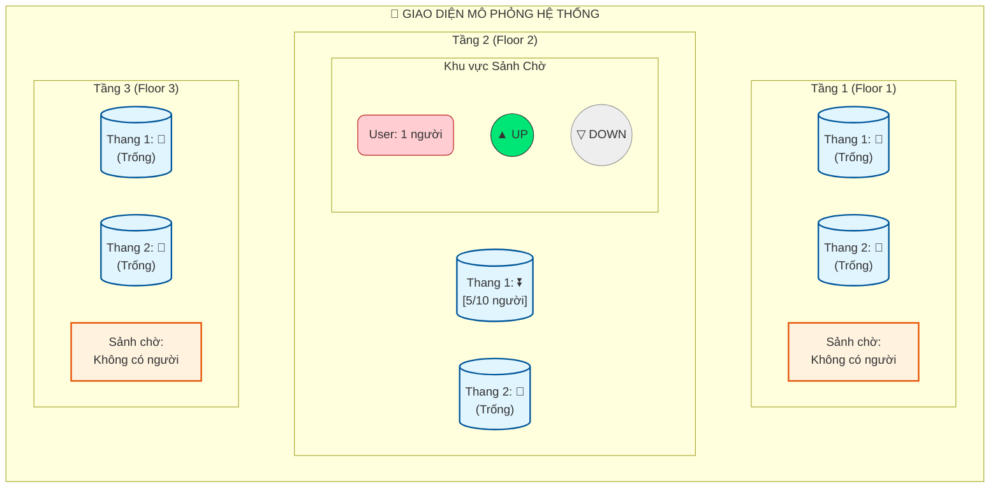

```mermaid
graph TD
    %% --- STYLE DEFINITIONS ---
    classDef elevator fill:#e1f5fe,stroke:#01579b,stroke-width:2px;
    classDef lobby fill:#fff3e0,stroke:#e65100,stroke-width:2px;
    classDef user fill:#ffcdd2,stroke:#b71c1c,stroke-width:1px,rx:10,ry:10;
    classDef btnOn fill:#00e676,stroke:#333,stroke-width:1px;
    classDef btnOff fill:#eee,stroke:#999,stroke-width:1px;

    %% --- GIAO DIỆN TÒA NHÀ ---
    subgraph UI ["🏢 GIAO DIỆN MÔ PHỎNG HỆ THỐNG"]
        
        %% TẦNG 3
        subgraph F3 ["Tầng 3 (Floor 3)"]
            direction LR
            E1_3[("Thang 1: 🛑\n(Trống)")]:::elevator
            E2_3[("Thang 2: 🛑\n(Trống)")]:::elevator
            L3["Sảnh chờ:\nKhông có người"]:::lobby
        end

        %% TẦNG 2 - CÓ SỰ KIỆN
        subgraph F2 ["Tầng 2 (Floor 2)"]
            direction LR
            E1_2[("Thang 1: ⏬\n[5/10 người]")]:::elevator
            E2_2[("Thang 2: 🛑\n(Trống)")]:::elevator
            
            subgraph L2_Panel ["Khu vực Sảnh Chờ"]
                direction TB
                U2(User: 1 người):::user
                Btn_Up((▲ UP)):::btnOn
                Btn_Down((▽ DOWN)):::btnOff
            end
        end

        %% TẦNG 1
        subgraph F1 ["Tầng 1 (Floor 1)"]
            direction LR
            E1_1[("Thang 1: 🛑\n(Trống)")]:::elevator
            E2_1[("Thang 2: 🛑\n(Trống)")]:::elevator
            L1["Sảnh chờ:\nKhông có người"]:::lobby
        end
    end

    %% Sắp xếp các tầng theo thứ tự
    F3 ~~~ F2 ~~~ F1
```
